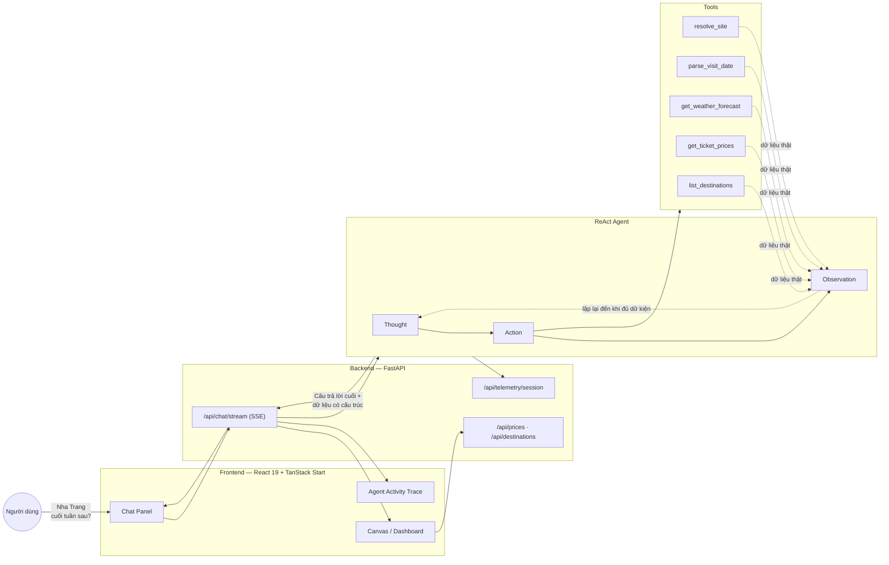

<div align="center">

# VinWonders Tour Guide

**AI Concierge cho du lịch VinWonders — trả lời bằng cách suy luận, không chỉ đoán.**


</div>

---

## Giới thiệu

Hỏi một câu bằng ngôn ngữ tự nhiên — nhận về lịch trình, giá vé thật và gợi ý dựa trên thời tiết, hiển thị theo thời gian thực khi agent đang suy luận.

VinWonders Tour Guide được xây dựng quanh một **ReAct agent** thay vì chatbot trả lời một lượt. Thay vì đoán câu trả lời ngay từ prompt, agent lập kế hoạch, gọi công cụ để lấy dữ liệu thật (thời tiết, giá vé, thông tin địa điểm), rồi mới tổng hợp câu trả lời cuối cùng. Mỗi bước suy luận — *Thought → Action → Observation* — được stream trực tiếp ra giao diện, cho phép người dùng theo dõi quá trình agent xử lý thay vì chỉ nhìn vòng xoay chờ.

**Điểm nổi bật**

- 💬 Chat streaming (SSE), phản hồi tiếng Việt tự nhiên
- 🎟️ Giá vé VinWonders thật, tra cứu theo địa điểm và ngày
- 🌦️ Kiểm tra thời tiết trước khi đưa ra khuyến nghị
- 🗺️ Dashboard trực quan — bản đồ, danh sách địa điểm, trace hoạt động của agent
- 📊 Telemetry dạng JSON có cấu trúc cho mọi request và tool call

---

## Kiến trúc hệ thống



---

## Tech Stack

| Layer | Công nghệ |
| --- | --- |
| **Frontend** | React 19, TanStack Start, Vite, Tailwind CSS, shadcn/ui (Radix) |
| **Backend** | FastAPI, Uvicorn, Pydantic v2, Server-Sent Events |
| **Agent / LLM** | ReAct loop tự viết — OpenAI, Gemini, OpenRouter, DS2API, hoặc model chạy local (llama.cpp) |
| **Nguồn dữ liệu** | Crawler giá vé VinWonders (requests + cloudscraper), OpenWeatherMap |
| **Observability** | Structured JSON logging, telemetry theo từng session |
| **Testing** | pytest, chạy offline hoàn toàn (không cần API key) |

---

## Cấu trúc thư mục

```
├── src/
│   ├── agent/          ReAct agent — vòng lặp Thought → Action → Observation
│   ├── chatbot/         Chatbot baseline một lượt (không dùng tool)
│   ├── core/             LLM provider factory
│   ├── llm/              Provider clients (OpenAI, Gemini, DS2API, local...)
│   ├── prompts/          System prompt templates
│   ├── telemetry/        Structured JSON logging
│   ├── tools/             resolve_site, parse_visit_date, get_weather_forecast,
│   │                       get_ticket_prices, list_destinations
│   └── vinwonders/       FastAPI server (chat SSE, giá vé, destinations, telemetry)
├── frontend/              Ứng dụng React (chat, dashboard, agent trace)
├── scripts/               Tiện ích đánh giá offline
├── tests/                 Bộ test pytest
├── docs/                  Tài liệu kiến trúc
├── main.py / chatbot.py / run_agent.py    CLI entry points
└── api_server.py          Server dự phòng (JSON, không streaming)
```

---

## Bắt đầu nhanh

### Yêu cầu

| Công cụ | Phiên bản |
| --- | --- |
| Python | 3.12+ |
| Node.js | 18+ |
| npm | 9+ |

### 1. Cài đặt

```powershell
py -m venv .venv
.\.venv\Scripts\pip install -r requirements.txt

copy .env.example .env
# điền OPENROUTER_API_KEY (hoặc DS2API_API_KEY) và OPENWEATHER_API_KEY

cd frontend && npm install && cd ..
```

### 2. Chạy ứng dụng

```powershell
# Terminal 1 — backend
.\.venv\Scripts\python -m src.vinwonders.server

# Terminal 2 — frontend
cd frontend
npm run dev
```

Mở **http://localhost:8080**.

Hoặc chạy cả hai cùng lúc:

```powershell
.\start.ps1
```

### 3. Dùng qua CLI

```powershell
.\.venv\Scripts\Activate.ps1

python run_agent.py "Nha Trang cuối tuần sau"   # ReAct agent
python chatbot.py "Nha Trang cuối tuần sau"     # chatbot baseline
```

### 4. Chạy offline với model local

```env
DEFAULT_PROVIDER=local
LOCAL_MODEL_PATH=./models/Phi-3-mini-4k-instruct-q4.gguf
```

Tải [Phi-3-mini-4k-instruct-GGUF](https://huggingface.co/microsoft/Phi-3-mini-4k-instruct-gguf) và đặt vào thư mục `models/`.

---

## API chính

| Endpoint | Mô tả |
| --- | --- |
| `POST /api/chat/stream` | Chat với agent, phản hồi dạng SSE |
| `GET /api/destinations` | Danh sách địa điểm VinWonders |
| `GET /api/prices` | Giá vé theo địa điểm / ngày |
| `GET /api/telemetry/session` | Thống kê telemetry của phiên |

---

## Kiểm thử

```powershell
python -m pytest tests/ -q
```

---

<div align="center">

Built with FastAPI, React, và một vòng lặp ReAct thực sự biết suy luận.

</div>
