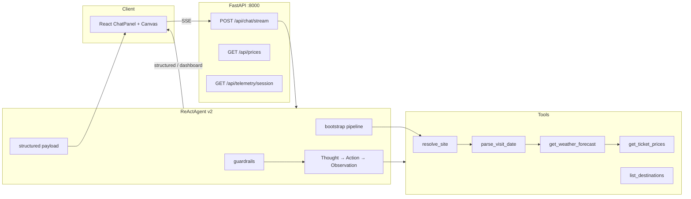

# Technical Document — VinWonders Tour Guide (C2-Team-040)

- **Team**: Nhóm 10
- **Product**: VinWonders Tour Guide — AI Concierge du lịch VinWonders
- **Lab**: Lab 3 — Chatbot vs ReAct Agent (Production-Grade Agentic System)
- **Cập nhật**: 2026-06-01

---

## 1. Tổng quan

Dự án xây dựng **chatbot baseline** (một lần gọi LLM, không tool) và **ReAct agent** có 5 tool VinWonders thật, so sánh độ tin cậy trên câu hỏi đa bước (địa điểm → ngày → thời tiết → giá vé).

Luồng sản phẩm chính:

```
User (React UI) → FastAPI SSE → ReActAgent v2 → Tools/API → Observation → Final Answer + Dashboard
```

Tài liệu kiến trúc chi tiết: [LAB3_ARCHITECTURE.md](./LAB3_ARCHITECTURE.md).

---

## 2. Tech Stack

### 2.1 Backend (Python)

| Thành phần | Công nghệ | Ghi chú |
| :--- | :--- | :--- |
| Runtime | Python 3.12+ | Virtualenv: `.venv/` hoặc `env/` (đã gitignore) |
| Web framework | **FastAPI** + **Uvicorn** | API REST + SSE streaming |
| Validation | **Pydantic v2** | Request/response models |
| Config | **python-dotenv** | `.env` — provider, API keys |
| HTTP client | **requests**, **cloudscraper** | Crawler giá vé VinWonders |
| Testing | **pytest** | Offline tests, không cần API key |

**Entry points backend:**

| File | Vai trò |
| :--- | :--- |
| `src/vinwonders/server.py` | Server chính — chat SSE, giá vé, destinations, telemetry |
| `api_server.py` | Server legacy — chat JSON `/api/chat` (dev stack cũ) |
| `main.py` | CLI — chatbot / agent / compare / eval |
| `chatbot.py`, `run_agent.py` | Shortcut CLI |

### 2.2 Frontend (TypeScript / React)

| Thành phần | Công nghệ |
| :--- | :--- |
| Framework | **React 19** |
| Routing / SSR | **TanStack Start** + **Vite** |
| UI | **Tailwind CSS**, **shadcn/ui** (Radix UI) |
| Icons | **lucide-react** |
| Build | Vite (`frontend/vite.config.ts`) |

**Module frontend chính:**

| Module | File | Chức năng |
| :--- | :--- | :--- |
| Chat | `ChatPanel.tsx` | Gửi tin nhắn, streaming reply |
| Agent trace | `AgentActivityPanel.tsx`, `AILoadingState.tsx` | Hiển thị Thought/Action/Observation |
| Dashboard | `Canvas.tsx`, `TicketsFlights.tsx` | Giá vé, lịch trình, map |
| Map | `VinWondersMapEmbed.tsx` | OpenStreetMap embed |
| SSE client | `chat-api.ts` | Parse SSE từ `/api/chat/stream` |

### 2.3 AI / LLM

| Provider | Env | Giao thức |
| :--- | :--- | :--- |
| **OpenRouter** (khuyến nghị web) | `AGENT_PROVIDER=openrouter` | OpenAI-compatible API |
| **DS2API / DeepSeek** | `AGENT_PROVIDER=ds2api` | Gateway OpenAI-compatible |
| OpenAI | `openai` | GPT-4o, … |
| Google Gemini | `google` / `gemini` | `google-generativeai` |
| Local GGUF | `local` | `llama-cpp-python` (tùy chọn) |

**Abstraction layer:** `src/core/llm_provider.py` — interface chung `generate()`; factory tại `src/core/factory.py` (web agent) và `src/core/provider_factory.py` (legacy `api_server`).

**Model mặc định (web):** `deepseek/deepseek-chat` qua OpenRouter.

### 2.4 Dịch vụ bên ngoài

| Dịch vụ | Tool / module | Mục đích |
| :--- | :--- | :--- |
| VinWonders Booking API | `src/vinwonders/crawler.py` | Giá vé live theo `supplierCode` + ngày |
| OpenWeatherMap | `src/tools/weather.py` | Dự báo thời tiết trước khi tư vấn vé |
| OpenRouter / DS2API | `src/core/factory.py` | Inference LLM |

### 2.5 Observability

| Thành phần | File | Output |
| :--- | :--- | :--- |
| Structured logger | `src/telemetry/logger.py` | `logs/YYYY-MM-DD.log` (JSON lines) |
| Metrics tracker | `src/telemetry/metrics.py` | `LLM_METRIC`: token, latency, cost |
| Session API | `GET /api/telemetry/session` | P50/P99 latency, tổng token/cost |

---

## 3. Kiến trúc hệ thống



### 3.1 Ba phiên bản inference

| Phiên bản | Tools | Bootstrap | Guardrails | UI trace |
| :--- | :---: | :---: | :---: | :---: |
| **Chatbot** | ✗ | ✗ | ✗ | ✗ |
| **Agent v1** | ✓ | ✗ | ✗ | Cơ bản |
| **Agent v2** | ✓ | ✓ | ✓ | SSE đầy đủ |

- Chatbot: `src/chatbot/vinwonders_chatbot.py`
- Agent: `src/agent/agent.py` — `prompt_version="v1"` | `"v2"`

---

## 4. Cấu trúc thư mục

```
C2-Team-040-AI-Chat-Bot/
├── src/
│   ├── agent/           # ReAct loop, bootstrap, guardrails, structured, trace
│   ├── chatbot/         # Baseline chatbot
│   ├── core/            # LLM providers, factory, api_errors
│   ├── prompts/         # System prompt Karphany v1/v2
│   ├── tools/           # 5 VinWonders tools + registry
│   ├── telemetry/       # logger, metrics
│   ├── utils/           # text, money helpers
│   └── vinwonders/      # crawler, server, destinations data
├── frontend/            # React app (TanStack Start + Vite)
├── tests/               # pytest — scoring, offline agent
├── scripts/             # eval_lab3.py
├── docs/                # LAB3_ARCHITECTURE, TECHNICAL_DOCUMENT
├── report/              # group + individual reports, traces, eval
├── logs/                # JSON logs (gitignore)
├── main.py              # CLI runner
├── chatbot.py           # CLI chatbot shortcut
└── run_agent.py         # CLI agent shortcut
```

---

## 5. ReAct Agent — Workflow kỹ thuật

### 5.1 Vòng lặp ReAct

```
Thought → Action → Observation → … → Final Answer
```

1. **Thought**: Model lập kế hoạch bước tiếp theo.
2. **Action**: Gọi tool dạng `tool_name(arg="value")`.
3. **Observation**: Kết quả JSON từ tool được append vào context.
4. Lặp tối đa `max_steps=10` hoặc dừng khi có `Final Answer`.

Parser regex trong `agent.py`: `THOUGHT_RE`, `ACTION_RE`, `FINAL_ANSWER_RE`.

### 5.2 Bootstrap pipeline (v2)

Trước vòng LLM, nếu nhận diện intent du lịch (`_TRAVEL_HINTS`), agent tự chạy:

```
resolve_site → parse_visit_date → get_weather_forecast → get_ticket_prices
```

Module: `src/agent/bootstrap.py`.

### 5.3 Guardrails (v2)

- `reject_premature_final()`: từ chối `Final Answer` nếu thiếu weather/prices khi câu hỏi yêu cầu.
- `_sanitize_tool_args()`: map alias tham số LLM (`location` → `query`, …).
- Persona **Karphany** từ chối off-topic (code, toán, …).

### 5.4 Tool inventory

| Tool | Input | Output |
| :--- | :--- | :--- |
| `list_destinations` | `region_query?` | Danh sách site + supplierCode |
| `resolve_site` | `query` | region, supplierCode, attractions |
| `parse_visit_date` | `expression` | `usingDate` DD-MM-YYYY |
| `get_weather_forecast` | `location`, `using_date` | temp, hasRain, recommendation |
| `get_ticket_prices` | `supplier_code`, `using_date` | tickets, cheapestFormatted |

Registry: `src/tools/registry.py` — `execute_tool()`, `VINWONDERS_TOOLS`.

---

## 6. Luồng request (Web UI)

### 6.1 Chat streaming

```
1. User gõ tin → ChatPanel.tsx
2. streamChat() POST /api/chat/stream { messages, stream: true }
3. server.py → ReActAgent.run_with_events()
4. SSE events → frontend:
   - trace        → loading progress
   - agent_step   → AgentActivityPanel
   - structured   → price cards, weather, map
   - dashboard    → Canvas sync
   - content      → token stream Final Answer
   - agent_done   → kết thúc run
5. UI render AssistantMessage + VinWondersMapEmbed
```

**SSE format:** `data: {json}\n\n` — kết thúc bằng `data: [DONE]\n\n`.

### 6.2 Tra giá vé thủ công (dashboard)

```
TicketsFlights → GET /api/prices?supplier_code=&date=
→ crawler.get_ticket_prices() → JSON giá vé
```

---

## 7. API Endpoints

| Method | Path | Mô tả |
| :--- | :--- | :--- |
| `POST` | `/api/chat/stream` | Chat agent SSE (chính) |
| `GET` | `/api/destinations` | JSON điểm đến VinWonders |
| `GET` | `/api/prices` | Giá vé theo supplier + ngày |
| `GET` | `/api/telemetry/session` | P50/P99, tokens, cost session |
| `GET` | `/api/health` | Health check (legacy `api_server.py`) |
| `POST` | `/api/chat` | Chat JSON không stream (legacy) |

**CORS:** `localhost:8080`, `5173` — proxy dev qua `frontend/vite.config.ts` (`/api` → `:8000`).

---

## 8. Workflow phát triển

### 8.1 Setup lần đầu

```bash
# 1. Clone & env
cp .env.example .env
# Điền: OPENROUTER_API_KEY, OPENWEATHER_API_KEY, DS2API_API_KEY (tùy provider)

# 2. Python
py -m venv .venv
.\.venv\Scripts\pip install -r requirements.txt

# 3. Frontend
cd frontend && npm install
```

### 8.2 Chạy dev

**Cách 1 — VinWonders server (khuyến nghị demo Lab 3):**

```bash
# Terminal 1
python -m src.vinwonders.server

# Terminal 2
cd frontend && npm run dev
# UI: http://localhost:8080
```

**Cách 2 — One-line (legacy api_server):**

```bash
.\start.ps1
# hoặc npm run dev   # concurrently backend + frontend
```

### 8.3 CLI & đánh giá

```bash
# Chatbot baseline
python chatbot.py "Nha Trang cuối tuần sau giá bao nhiêu?"

# Agent v1 vs v2
python run_agent.py "Nha Trang cuối tuần sau" --version v1
python run_agent.py "Nha Trang cuối tuần sau" --version v2

# So sánh chatbot / agent
python main.py compare

# Eval offline (6/6 checks, không cần API)
python scripts/eval_lab3.py --offline
python main.py eval --offline

# Unit tests
python -m pytest tests/test_vinwonders_scoring.py -q
```

### 8.4 Workflow Git (team)

| Branch | Vai trò chính |
| :--- | :--- |
| `main` | Nhánh tích hợp |
| `taiBranch` | Frontend, full-stack bootstrap, provider setup |
| `nguyenBranch` | Agent v2, tools VinWonders, crawler, SSE, telemetry |
| `anhBranch` | HTTP error handling, bổ sung frontend |

Quy trình: feature branch → merge `main` → demo / báo cáo trong `report/`.

### 8.5 Debug & RCA

1. Đọc `logs/YYYY-MM-DD.log` — events: `AGENT_START`, `AGENT_STEP`, `TOOL_CALL`, `TOOL_RESULT`, `LLM_METRIC`, `API_ERROR`.
2. Trace JSON mẫu: `report/traces/`.
3. Tab **Agent hoạt động** trên UI — mirror SSE `agent_step`.

---

## 9. Biến môi trường quan trọng

| Biến | Mô tả |
| :--- | :--- |
| `AGENT_PROVIDER` | `openrouter` \| `ds2api` \| `openai` \| `google` \| `local` |
| `AGENT_MODEL` | Model cho ReAct agent |
| `OPENROUTER_API_KEY` | Key OpenRouter (web chat) |
| `DS2API_API_KEY` | Key DS2API gateway |
| `OPENWEATHER_API_KEY` | Tool thời tiết |
| `API_PORT` | Port backend (mặc định 8000) |
| `VITE_VINWONDERS_API` | Base URL API cho frontend (dev: rỗng + proxy) |

Chi tiết: `.env.example`.

---

## 10. Telemetry & chi phí

Mỗi lần gọi LLM ghi event `LLM_METRIC`:

```json
{
  "event": "LLM_METRIC",
  "data": {
    "provider": "openrouter",
    "model": "deepseek/deepseek-chat",
    "prompt_tokens": 702,
    "completion_tokens": 222,
    "latency_ms": 9280,
    "cost_estimate_usd": 0.00924
  }
}
```

`tracker.session_summary()` trả P50/P99 latency, tổng token, tổng cost — dùng trong báo cáo nhóm §3.

---

## 11. Tài liệu liên quan

| Tài liệu | Nội dung |
| :--- | :--- |
| [LAB3_ARCHITECTURE.md](./LAB3_ARCHITECTURE.md) | Sơ đồ Mermaid, bảng so sánh agent |
| [SCORING.md](../SCORING.md) | Rubric chấm điểm Lab 3 |
| [report/group_report/GROUP_REPORT_10.md](../report/group_report/GROUP_REPORT_10.md) | Báo cáo nhóm |
| [report/TOOL_DESIGN_EVOLUTION.md](../report/TOOL_DESIGN_EVOLUTION.md) | Tiến hóa thiết kế tool |
