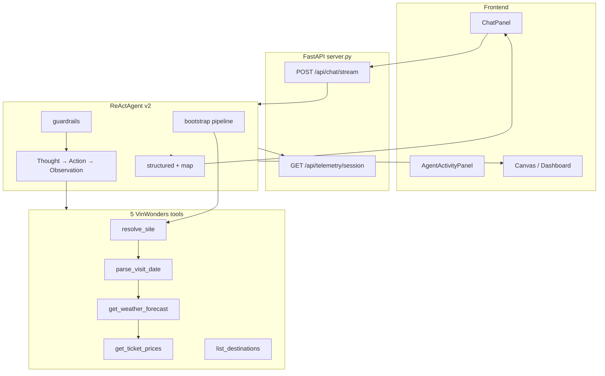

# Lab 3 Architecture — VinWonders Tour Guide

## Chatbot vs Agent

| | Chatbot | Agent v1 | Agent v2 |
| :--- | :--- | :--- | :--- |
| Tools | No | Yes | Yes + bootstrap |
| Live prices | No | Sometimes hallucinates | API + guardrails |
| Trace UI | No | Basic | Full SSE trace |
